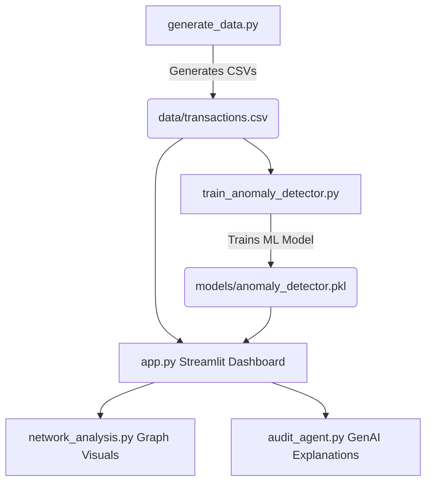

# 🛡️ AI-Powered Financial Fraud Detection & Intelligent Auditing Platform

An end-to-end Intelligent Auditing Platform that combines **Unsupervised Machine Learning (Isolation Forest)**, **Network Graph Analysis**, and **Generative AI (LLM Audit Agent)** to detect, visualize, and explain financial fraud.

---

## 🚀 Key Features

*   **Synthetic Transaction Simulator (`generate_data.py`)**: Simulates realistic financial transactions complete with normal patterns and engineered structural fraud anomalies (such as rapid circular transfers and structuring).
*   **Unsupervised Anomaly Detection (`train_anomaly_detector.py`)**: Train an Isolation Forest model to detect outlier transactions and compute risk scores.
*   **Network Graph Analysis (`network_analysis.py`)**: Maps entity relationships and detects high-risk transaction networks or circular money trails using NetworkX.
*   **GenAI Intelligent Audit Agent (`audit_agent.py`)**: A LangChain-powered agent that translates complex anomalies and risk factors into natural language explanations and generates auditing reports.
*   **Interactive Analytics Dashboard (`app.py`)**: An elegant, real-time Streamlit dashboard designed for forensic auditors to search, visualize, and investigate flagged cases.

---

## 🛠️ Technology Stack

*   **Language**: Python 3.8+
*   **Machine Learning**: Scikit-Learn (Isolation Forest)
*   **Network Analysis**: NetworkX (Graph Theory)
*   **Generative AI**: LangChain, LLM (Gemini / OpenAI API)
*   **Dashboard**: Streamlit
*   **Data Wrangling**: Pandas, NumPy

---

## 📋 Getting Started

### 1. Installation
Clone the repository and install the dependencies:
```bash
pip install -r requirements.txt
```

### 2. Set Up Environment Variables
Create a `.env` file in the project directory (ignored by git for security) and add your LLM API keys:
```env
GEMINI_API_KEY=your_gemini_api_key_here
```

### 3. Run the Pipeline
Execute the files in the following order:

1. **Generate synthetic transactional data**:
   ```bash
   python generate_data.py
   ```
2. **Train the ML model and evaluate anomaly detection**:
   ```bash
   python train_anomaly_detector.py
   ```
3. **Launch the interactive Streamlit dashboard**:
   ```bash
   streamlit run app.py
   ```

---

## 📊 Project Architecture & Workflow


